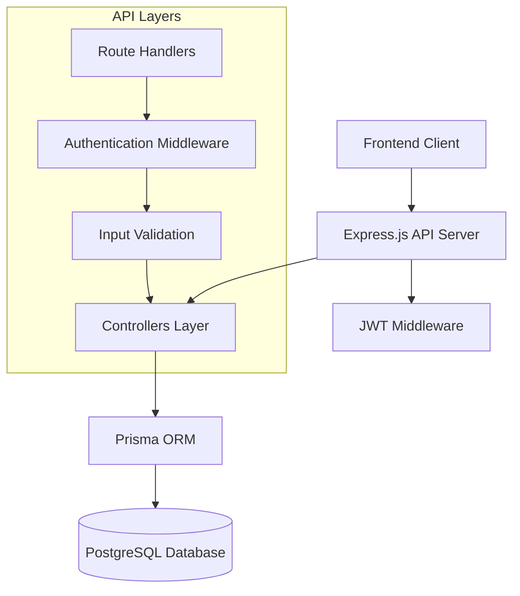

# Design Document

## Overview

The Capsort backend is a RESTful API built with Node.js and Express.js that provides authentication, project management, and user favorites functionality for a capstone collection platform. The system uses PostgreSQL with Prisma ORM for data persistence, JWT for authentication, and implements role-based access control.

## Architecture

### High-Level Architecture



### Technology Stack

- **Runtime**: Node.js
- **Framework**: Express.js
- **Database**: PostgreSQL (Neon hosted)
- **ORM**: Prisma
- **Authentication**: JWT (JSON Web Tokens)
- **Password Hashing**: bcryptjs
- **Validation**: express-validator
- **CORS**: cors middleware

## Components and Interfaces

### 1. Authentication System

#### JWT Middleware (`src/middleware/auth.js`)
- **Purpose**: Verify JWT tokens and extract user information
- **Functions**:
  - `authenticateToken()`: Validates JWT and adds user to request
  - `requireRole(role)`: Ensures user has required role
- **Error Handling**: Returns 401 for invalid/missing tokens, 403 for insufficient permissions

#### Auth Controller (`src/controllers/authController.js`)
- **Purpose**: Handle user registration, login, and profile retrieval
- **Functions**:
  - `register()`: Create new user with hashed password
  - `login()`: Authenticate user and return JWT
  - `getCurrentUser()`: Return current user profile
- **Validation**: Email format, password strength, required fields

### 2. Project Management System

#### Project Controller (`src/controllers/projectController.js`)
- **Purpose**: Handle CRUD operations for capstone projects
- **Functions**:
  - `getAllProjects()`: Fetch projects with filtering and search
  - `getProjectById()`: Fetch single project with uploader info
  - `createProject()`: Create new project (admin only)
  - `updateProject()`: Update existing project (admin only)
  - `deleteProject()`: Remove project and associated saved records (admin only)

#### Query Features
- **Filtering**: By field (IoT, Database, etc.) and year
- **Search**: Full-text search on title and author fields
- **Sorting**: Order by creation date (newest first)
- **Relations**: Include uploader information in responses

### 3. Saved Projects System

#### Saved Project Controller (`src/controllers/savedProjectController.js`)
- **Purpose**: Manage user's favorite projects
- **Functions**:
  - `getSavedProjects()`: Fetch user's saved projects with full details
  - `saveProject()`: Add project to user's favorites
  - `unsaveProject()`: Remove project from user's favorites
- **Constraints**: Prevent duplicate saves via unique database constraint

### 4. Database Layer

#### Prisma Configuration (`src/config/database.js`)
- **Purpose**: Initialize and export Prisma client
- **Connection**: PostgreSQL via Supabase connection string
- **Error Handling**: Database connection failures

## Data Models

### User Model
```prisma
model User {
  id            Int            @id @default(autoincrement())
  fullName      String
  contactNumber String
  email         String         @unique
  password      String         // bcrypt hashed
  role          String         // "admin" | "student"
  createdAt     DateTime       @default(now())
  projects      Project[]      // Projects uploaded by user
  savedProjects SavedProject[] // User's saved projects
}
```

### Project Model
```prisma
model Project {
  id         Int            @id @default(autoincrement())
  title      String
  author     String
  year       Int
  field      String         // IoT, Database, etc.
  fileUrl    String
  uploadedBy Int
  uploader   User           @relation(fields: [uploadedBy], references: [id])
  createdAt  DateTime       @default(now())
  savedBy    SavedProject[] // Users who saved this project
}
```

### SavedProject Model
```prisma
model SavedProject {
  id        Int      @id @default(autoincrement())
  userId    Int
  projectId Int
  user      User     @relation(fields: [userId], references: [id])
  project   Project  @relation(fields: [projectId], references: [id])
  createdAt DateTime @default(now())
  
  @@unique([userId, projectId]) // Prevent duplicate saves
}
```

## API Endpoints Design

### Authentication Routes (`/api/auth`)
- `POST /register`: User registration with validation
- `POST /login`: User authentication with JWT generation
- `GET /me`: Get current user profile (protected)

### Project Routes (`/api/projects`)
- `GET /`: Get all projects with optional filters (public)
- `GET /:id`: Get single project by ID (public)
- `POST /`: Create new project (admin only)
- `PUT /:id`: Update project (admin only)
- `DELETE /:id`: Delete project (admin only)

### Saved Project Routes (`/api/saved-projects`)
- `GET /`: Get user's saved projects (protected)
- `POST /`: Save a project to favorites (protected)
- `DELETE /:projectId`: Remove project from favorites (protected)

## Security Design

### Password Security
- **Hashing**: bcryptjs with salt rounds (12)
- **Storage**: Never store plain text passwords
- **Transmission**: Passwords excluded from all API responses

### JWT Implementation
- **Secret**: Environment variable `JWT_SECRET`
- **Expiration**: 7 days configurable via `JWT_EXPIRES_IN`
- **Payload**: User ID and role for authorization
- **Verification**: Middleware validates all protected routes

### Role-Based Access Control
- **Admin Role**: Full CRUD access to projects
- **Student Role**: Read access to projects, full access to saved projects
- **Public Access**: Read-only access to projects

### Input Validation
- **express-validator**: Validate all input data
- **Sanitization**: Clean and normalize input
- **Error Messages**: Specific field-level validation errors

## Error Handling

### Error Response Format
```json
{
  "error": "Error message",
  "details": ["Specific field errors"],
  "status": 400
}
```

### HTTP Status Codes
- **200**: Success
- **201**: Created
- **400**: Bad Request (validation errors)
- **401**: Unauthorized (authentication required)
- **403**: Forbidden (insufficient permissions)
- **404**: Not Found
- **500**: Internal Server Error

### Error Categories
1. **Validation Errors**: Input validation failures
2. **Authentication Errors**: Invalid/missing JWT tokens
3. **Authorization Errors**: Insufficient role permissions
4. **Database Errors**: Connection or query failures
5. **Business Logic Errors**: Duplicate saves, non-existent resources

## Testing Strategy

### Unit Testing
- **Controllers**: Test business logic and error handling
- **Middleware**: Test authentication and authorization
- **Validation**: Test input validation rules
- **Database**: Test Prisma operations

### Integration Testing
- **API Endpoints**: Test complete request/response cycles
- **Authentication Flow**: Test registration, login, and protected routes
- **CRUD Operations**: Test project management workflows
- **Saved Projects**: Test favorites functionality

### Test Data
- **Mock Users**: Admin and student test accounts
- **Sample Projects**: Various fields and years for filtering tests
- **Edge Cases**: Invalid data, missing fields, unauthorized access

### Testing Tools
- **Jest**: Testing framework
- **Supertest**: HTTP assertion library
- **Test Database**: Separate database for testing

## Deployment Configuration

### Environment Variables
```env
DATABASE_URL="postgresql://..."
JWT_SECRET="secure-random-string"
JWT_EXPIRES_IN="7d"
PORT=5000
NODE_ENV="production"
CLIENT_URL="https://frontend-domain.com"
```

### CORS Configuration
- **Origins**: Specific frontend URL only
- **Methods**: GET, POST, PUT, DELETE
- **Headers**: Authorization, Content-Type
- **Credentials**: Enabled for JWT cookies

### Database Migration
- **Prisma Migrate**: Handle schema changes
- **Seed Data**: Initial admin user and sample projects
- **Backup Strategy**: Regular database backups

### Performance Considerations
- **Database Indexing**: Indexes on frequently queried fields
- **Query Optimization**: Efficient Prisma queries with proper includes
- **Caching**: Consider Redis for frequently accessed data
- **Rate Limiting**: Prevent API abuse

## File Structure
```
capsort-backend/
├── src/
│   ├── config/
│   │   └── database.js          # Prisma client setup
│   ├── controllers/
│   │   ├── authController.js    # Authentication logic
│   │   ├── projectController.js # Project CRUD operations
│   │   └── savedProjectController.js # Saved projects logic
│   ├── middleware/
│   │   └── auth.js              # JWT verification & authorization
│   ├── routes/
│   │   ├── authRoutes.js        # Authentication endpoints
│   │   ├── projectRoutes.js     # Project endpoints
│   │   └── savedProjectRoutes.js # Saved project endpoints
│   └── index.js                 # Main server file
├── prisma/
│   └── schema.prisma            # Database schema
├── .env                         # Environment variables
├── .gitignore
└── package.json
```